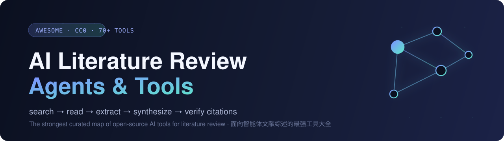

<div align="center">



# Awesome AI Literature Review Agents & Tools

**🤖 The strongest curated list of open-source skills, tools & frameworks for AI-agent literature reviewing**

_Let AI agents handle the whole loop: search → read → extract → synthesize → verify citations_

[](https://awesome.re)
[](CONTRIBUTING.md)
[](LICENSE)
[](https://github.com/brycewang-stanford/lit-review-agent-tools/stargazers)
[](https://github.com/brycewang-stanford/lit-review-agent-tools/commits)
<!-- BEGIN GENERATED:badge -->

<!-- END GENERATED:badge -->

[简体中文](README.md) · **English**

<!-- BEGIN GENERATED:tagline -->
<em><b>66</b> open-source projects for literature review, organized by use case · updated quarterly · PRs welcome</em>
<!-- END GENERATED:tagline -->

</div>

---

> Open-source AI agents, Claude Code / Codex skills, MCP servers, systematic-review screeners, PDF parsers,
> citation graphs, and auto-survey frameworks — all for **literature review**.
> Goal: a **one-stop map** for researchers doing literature work with AI. ⭐ **Star it for later.**

## 📑 Table of Contents

- [Why this list](#why-this-list)
- [⚡ 30-second picker](#-30-second-picker)
<!-- BEGIN GENERATED:toc -->
- [🌟 All-in-one Research Agents & Skills](#-all-in-one-research-agents--skills)
- [🔎 Deep Research & Auto Survey Generation](#-deep-research--auto-survey-generation)
- [🧪 Autonomous Science: idea → paper](#-autonomous-science-idea--paper)
- [📚 Paper Q&A and RAG](#-paper-qa-and-rag)
- [🧮 Systematic Review & Screening](#-systematic-review--screening)
- [🔌 MCP Servers](#-mcp-servers)
- [🗂️ Reference & Knowledge Management (Zotero / Obsidian)](#️-reference--knowledge-management-zotero--obsidian)
- [📄 PDF → Structured Data Extraction](#-pdf--structured-data-extraction)
- [🕸️ Citation Graphs & API Clients](#️-citation-graphs--api-clients)
- [✍️ Writing & Peer-review Assistants](#️-writing--peer-review-assistants)
- [📖 Awesome Lists](#-awesome-lists)
<!-- END GENERATED:toc -->
- [🏢 Commercial / Closed-source (for reference)](#-commercial--closed-source-for-reference)
- [🧭 How to choose (decision table)](#-how-to-choose-decision-table)
- [📈 Star history](#-star-history)
- [🤝 Contributing](#-contributing)
- [📄 License](#-license)

> ⭐ = editor's pick ｜ Star counts are GitHub-API snapshots, **auto-refreshed weekly by a GitHub Action**.
>
> **Health** (from the last push): 🟢 within 90 days · 🟡 within a year · 🔴 over a year · 🗄️ archived.
> It's a recency signal, not a quality verdict — a finished, stable tool can sit untouched for a year
> and still work fine. Read 🔴 as *check before you depend on it*, not *broken*.
>
> **License** decides whether you may actually use it: `none` means the repo ships **no license file**,
> so it is all-rights-reserved by default; `CC-BY-NC*` **forbids commercial use**; `custom` means read it
> yourself. Full metadata in [HEALTH.md](HEALTH.md).

---

## Why this list

Literature review is one of the most time-consuming parts of research: searching, de-duplicating,
close reading, thematic synthesis, citation checking… A wave of AI tools now automates some (or all)
of these steps, but they're scattered across GitHub, vary wildly in quality, and are confusingly named.

Three principles behind this list:

1. **Organized by use case** — you arrive with "what I need to do," not to dig through hundreds of repos.
2. **Only relevant, usable open-source projects** — commercial tools get a separate reference section.
3. **Honest info** — star counts verified via the GitHub API, links continuously checked by CI.

---

## ⚡ 30-second picker

```text
I use Claude Code and want end-to-end research→paper ────────▶ academic-research-skills ⭐
I want AI to research a topic and produce a cited report ────▶ GPT Researcher / STORM
I want fully autonomous "idea → submittable paper" ─────────▶ AI-Scientist-v2 / AutoResearchClaw
I need citation-backed Q&A over a pile of PDFs ─────────────▶ PaperQA2
I'm doing a rigorous PRISMA review (thousands of abstracts) ▶ ASReview / prismAId
I need clean Markdown from PDFs to feed an LLM ─────────────▶ MinerU / Docling / marker
I want lit capabilities inside Claude / Cursor (MCP) ──────▶ paper-search-mcp / zotero-mcp
I want to chat with my library inside Zotero ──────────────▶ zotero-gpt / PapersGPT
```

---

<!-- BEGIN GENERATED:categories -->
## 🌟 All-in-one Research Agents & Skills

> End-to-end `research → write → review → revise` solutions — mostly Claude Code / Codex skills.

| Project | Stars | Health | License | Notes |
|---|---|---|---|---|
| ⭐ [academic-research-skills](https://github.com/Imbad0202/academic-research-skills) | ~39.7k | 🟢 | CC-BY-NC-4.0 | **The most popular project in this space.** A suite of Claude Code skills running a 10-stage pipeline (research→write→review→revise→finalize) with citation/claim "integrity gates," cross-checked against Semantic Scholar + OpenAlex + Crossref. Philosophy: *"AI is your copilot, not the pilot."* `/plugin install academic-research-skills` |
| [academic-research-skills-codex](https://github.com/Imbad0202/academic-research-skills-codex) | ~7.2k | 🟢 | CC-BY-NC-4.0 | Codex-native sibling of the above, human-in-the-loop research flow |
| [Research-Paper-Writing-Skills](https://github.com/Master-cai/Research-Paper-Writing-Skills) | ~5.5k | 🟢 | MIT | ML/CV/NLP paper-writing skill pack; works with Codex, Claude Code, and Gemini |
| [claude-skills](https://github.com/alirezarezvani/claude-skills) | ~23.3k | 🟢 | MIT | Large skill collection incl. a litreview / grants / deep-research stack across Claude Code / Codex / Gemini / Cursor |
| [academic-paper-skills](https://github.com/lishix520/academic-paper-skills) | ~1.1k | 🟡 | MIT | Strategist (planning) + Composer (writing) skills with quality checkpoints |
| [dr-claw](https://github.com/OpenLAIR/dr-claw) | ~1.0k | 🟢 | custom | A "research IDE" with multiple AI-assistant personas |
| [ScienceClaw](https://github.com/beita6969/ScienceClaw) | 870 | 🟢 | MIT | Self-evolving AI research colleague, 285 skills, "zero hallucination" claim |
| [qinyan-academic-skills](https://github.com/LeonChaoX/qinyan-academic-skills) | 722 | 🟢 | MIT | Multilingual library of 182 installable AI-agent skills across disciplines |
| [agent-research-skills](https://github.com/lingzhi227/agent-research-skills) | 238 | 🟡 | none | Claude Code skills for systematic literature review, incl. citation-validation scripts |
| [medsci-skills](https://github.com/Aperivue/medsci-skills) | 219 | 🟢 | MIT | Medical-research skills: search, reporting-guideline/citation checks, stats, figures, submission (by a physician-researcher) |

---

## 🔎 Deep Research & Auto Survey Generation

> Give it a topic; it searches and produces a cited report / survey / related-work section.

| Project | Stars | Health | License | Notes |
|---|---|---|---|---|
| ⭐ [STORM](https://github.com/stanford-oval/storm) | ~30.3k | 🟡 | MIT | Stanford OVAL; retrieval-grounded "pre-writing + writing" stages, produces Wikipedia-style long articles with citations; includes conversational Co-STORM |
| ⭐ [gpt-researcher](https://github.com/assafelovic/gpt-researcher) | ~28.7k | 🟢 | Apache-2.0 | Autonomous agent that runs deep research on any topic and outputs a cited report; general-purpose, not academic-only |
| [deep-research](https://github.com/dzhng/deep-research) | ~19.4k | 🟡 | MIT | Minimal iterative deep-research agent (search + scrape + LLM refinement); small and hackable |
| [open_deep_research](https://github.com/langchain-ai/open_deep_research) | ~12.4k | 🟢 | MIT | LangChain's official open deep-research reference implementation |
| [local-deep-research](https://github.com/LearningCircuit/local-deep-research) | ~8.8k | 🟢 | MIT | Local/private deep-research; 10+ sources incl. arXiv & PubMed, fully local LLMs |
| [open-deep-research](https://github.com/nickscamara/open-deep-research) | ~6.3k | 🔴 | Apache-2.0 | Open deep-research clone reasoning over web data via Firecrawl |
| [SurveyX](https://github.com/IAAR-Shanghai/SurveyX) | 986 | 🟡 | none | Automated academic survey-paper generation from a topic |
| [LitLLM](https://github.com/LitLLM/LitLLM) | 44 | 🟢 | Apache-2.0 | Toolkit focused on scientific literature review; RAG + prompting to draft related-work fast (TMLR 2025) |
| [opendraft](https://github.com/federicodeponte/opendraft) | 338 | 🟢 | MIT | Free & open-source AI paper writer; 19 agents collaborate to draft long papers |
| [AutoSurveyGPT](https://github.com/a554b554/AutoSurveyGPT) | 156 | 🔴 | MIT | Uses GPT to find & rank Google Scholar papers and auto-generate a survey |

---

## 🧪 Autonomous Science: idea → paper

> End-to-end "automated scientific discovery" — lit review + hypotheses + experiments + writing + self-review. The most ambitious category.

| Project | Stars | Health | License | Notes |
|---|---|---|---|---|
| ⭐ [AI-Scientist](https://github.com/SakanaAI/AI-Scientist) | ~14.3k | 🟡 | custom | Sakana AI; end-to-end automated discovery (lit review→experiments→writing→review); see also [v2](https://github.com/SakanaAI/AI-Scientist-v2) (~6.9k, agentic tree search, workshop-level) |
| [AutoResearchClaw](https://github.com/aiming-lab/AutoResearchClaw) | ~13.9k | 🟢 | MIT | Self-evolving autonomous research: idea → conference-ready LaTeX paper (real lit from OpenAlex/S2/arXiv + sandboxed experiments + multi-agent peer review) |
| [Agent-Laboratory](https://github.com/SamuelSchmidgall/AgentLaboratory) | ~5.8k | 🟡 | MIT | End-to-end autonomous workflow: literature review → experimentation → report writing |
| [SciAgentsDiscovery](https://github.com/lamm-mit/SciAgentsDiscovery) | 627 | 🔴 | Apache-2.0 | Multi-agent (ontologist/scientist/critic) automated hypothesis & discovery system |
| [Zochi](https://github.com/IntologyAI/Zochi) | 311 | 🟡 | MIT | "Artificial scientist" doing end-to-end discovery to peer-reviewed publication |
| [DeepInnovator](https://github.com/HKUDS/DeepInnovator) | 279 | 🟡 | MIT | Autonomously generates research ideas, questions, testable hypotheses & experiment designs |

---

## 📚 Paper Q&A and RAG

> Grounded, **citation-backed** Q&A and extraction over a corpus of PDFs / papers.

| Project | Stars | Health | License | Notes |
|---|---|---|---|---|
| ⭐ [paper-qa](https://github.com/Future-House/paper-qa) | ~8.9k | 🟢 | Apache-2.0 | FutureHouse; high-accuracy RAG for scientific papers, answers **always cite sources**; PaperQA2 claims superhuman literature search |
| [paperai](https://github.com/neuml/paperai) | ~1.8k | 🟢 | Apache-2.0 | Semantic search + Q&A over medical & scientific papers |
| [openpaper](https://github.com/khoj-ai/openpaper) | 395 | 🟢 | AGPL-3.0 | Research-library workbench: read/annotate papers + AI lit-review assistant with grounded citations |

---

## 🧮 Systematic Review & Screening

> For rigorous evidence-based / PRISMA reviews — screen thousands of abstracts efficiently.

| Project | Stars | Health | License | Notes |
|---|---|---|---|---|
| ⭐ [ASReview](https://github.com/asreview/asreview) | 956 | 🟢 | Apache-2.0 | Active-learning screener for systematic reviews; interactively ranks papers to cut screening time; well-established in academia |
| [LatteReview](https://github.com/PouriaRouzrokh/LatteReview) | 117 | 🟢 | CC-BY-NC-ND-4.0 | Low-code Python package automating SR screening via AI agents (OpenAI/Gemini/Claude/Ollama) |
| [prismAId](https://github.com/Open-and-Sustainable/prismAId) | 24 | 🟢 | AGPL-3.0 | Generative-AI, protocol-based systematic-review toolkit; no-code, replicable screening & extraction |
| [prisma-review-tool](https://github.com/Black-Lights/prisma-review-tool) | niche | 🟡 | MIT | PRISMA 2020 flow with AI-assisted screening via MCP (arXiv/OpenAlex/S2, no API keys) |

---

## 🔌 MCP Servers

> Bring literature capabilities into Claude / Cursor / Cline and other Model Context Protocol clients.

| Project | Stars | Health | License | Notes |
|---|---|---|---|---|
| ⭐ [zotero-mcp](https://github.com/54yyyu/zotero-mcp) | ~4.4k | 🟢 | MIT | Connects a Zotero library (local + web API) to AI: semantic search, PDF full-text, citation analysis. The most popular Zotero MCP |
| ⭐ [arxiv-mcp-server](https://github.com/blazickjp/arxiv-mcp-server) | ~3.0k | 🟢 | Apache-2.0 | Search & analyze arXiv papers; downloads and converts PDFs to Markdown for LLM context; ships an `.mcpb` bundle |
| [paper-search-mcp](https://github.com/openags/paper-search-mcp) | ~2.3k | 🟢 | MIT | Multi-source search/download across 20+ sources (arXiv, PubMed, bioRxiv, S2, OpenAlex, Crossref, CORE…) |
| [PubMed-MCP-Server](https://github.com/JackKuo666/PubMed-MCP-Server) | 122 | 🔴 | MIT | Search, access, and analyze PubMed articles (metadata + deep analysis) |
| [alex-mcp](https://github.com/drAbreu/alex-mcp) | 50 | 🟡 | MIT | OpenAlex MCP focused on author disambiguation and institution/work lookup |
| [openalex-research-mcp](https://github.com/oksure/openalex-research-mcp) | 37 | 🟢 | MIT | OpenAlex (240M+ works): citation analysis, research-trend tracking, collaboration networks |

---

## 🗂️ Reference & Knowledge Management (Zotero / Obsidian)

> Embed AI into the reference-manager / note-taking workflow you already use.

| Project | Stars | Health | License | Notes |
|---|---|---|---|---|
| ⭐ [zotero-gpt](https://github.com/MuiseDestiny/zotero-gpt) | ~7.3k | 🟢 | AGPL-3.0 | GPT integrated into Zotero to chat with your library |
| [papersgpt-for-zotero](https://github.com/papersgpt/papersgpt-for-zotero) | ~2.6k | 🟢 | AGPL-3.0 | Zotero AI + MCP plugin; chat/batch-process PDFs across 30+ LLMs |
| [ai-research-assistant](https://github.com/lifan0127/ai-research-assistant) | ~1.7k | 🔴 | AGPL-3.0 | "Aria" — LLM-powered research assistant inside Zotero |
| [paper-note-filler](https://github.com/chauff/paper-note-filler) | 47 | 🟡 | none | Obsidian plugin auto-creating notes from arXiv / ACL Anthology / Semantic Scholar |

---

## 📄 PDF → Structured Data Extraction

> The invisible infrastructure of lit review: turn PDFs into clean, structured Markdown / JSON for LLMs.

| Project | Stars | Health | License | Notes |
|---|---|---|---|---|
| ⭐ [MinerU](https://github.com/opendatalab/MinerU) | ~75.8k | 🟢 | Apache-2.0 | High-accuracy PDF/Office → LLM-ready Markdown/JSON (VLM+OCR, 100+ languages, formulas/tables) |
| [docling](https://github.com/docling-project/docling) | ~63.8k | 🟢 | MIT | IBM-origin document parser prepping PDFs/docs for gen-AI/RAG |
| [marker](https://github.com/datalab-to/marker) | ~37.9k | 🟢 | Apache-2.0 | Fast PDF/doc → clean Markdown/JSON conversion, scientific-doc friendly |
| [PDFMathTranslate](https://github.com/PDFMathTranslate/PDFMathTranslate) | ~35.8k | 🟢 | AGPL-3.0 | Layout-preserving scientific-PDF translation (formulas/figures intact) |
| [grobid](https://github.com/grobidOrg/grobid) | ~5.0k | 🟢 | Apache-2.0 | ML tool extracting structured TEI/XML (metadata, refs, sections) from scholarly PDFs |
| [paperetl](https://github.com/neuml/paperetl) | 697 | 🟡 | Apache-2.0 | ETL pipeline for medical & scientific papers into structured stores |
| [scipdf_parser](https://github.com/titipata/scipdf_parser) | 455 | 🔴 | MIT | Python parser for scientific-publication PDFs (content + figures, GROBID-backed) |

---

## 🕸️ Citation Graphs & API Clients

> Analyze citation networks, or hit the major scholarly databases straight from code.

| Project | Stars | Health | License | Notes |
|---|---|---|---|---|
| [scholarly](https://github.com/scholarly-python-package/scholarly) | ~1.9k | 🟡 | Unlicense | Pythonic Google Scholar author/publication retrieval |
| [semanticscholar](https://github.com/danielnsilva/semanticscholar) | 476 | 🟢 | MIT | Unofficial Python client for Semantic Scholar APIs |
| [pyalex](https://github.com/J535D165/pyalex) | 400 | 🟢 | MIT | Lightweight Python interface to the OpenAlex API |
| [ArxivDigest](https://github.com/AutoLLM/ArxivDigest) | 452 | 🔴 | MIT | Personalized daily arXiv digest with GPT relevancy scoring + email pipeline |
| [citegraph](https://github.com/Citegraph/citegraph) | 22 | 🟡 | MIT | Open web visualizer of 5M+ papers / citation networks (CS bibliography) |

---

## ✍️ Writing & Peer-review Assistants

> Draft, polish, and run an "AI pre-review" before you submit.

| Project | Stars | Health | License | Notes |
|---|---|---|---|---|
| [lmms-lab-writer](https://github.com/EvolvingLMMs-Lab/lmms-lab-writer) | 256 | 🟢 | MIT | Local-first agentic LaTeX writer for AI-assisted academic writing |
| [academic-writing-agents](https://github.com/andrehuang/academic-writing-agents) | 146 | 🟢 | MIT | Claude Code plugin: 10+ specialist agents for academic writing review, research, drafting, polishing |
| [ai-peer-review](https://github.com/poldrack/ai-peer-review) | 151 | 🟢 | MIT | Multi-LLM meta-review: independent reviews synthesized into a meta-review |
| [open_reviewer](https://github.com/maxidl/openreviewer) | 14 | 🔴 | none | Generates high-quality peer reviews of ML/AI conference papers for pre-submission feedback |
| [academic-research-plugin](https://github.com/JeanDiable/academic-research-plugin) | 18 | 🟡 | MIT | Claude Code plugin: lit surveys, paper reviews, citation management; searches arXiv/S2/DBLP and finds research gaps |

---

## 📖 Awesome Lists

> Want the full picture? Start from these community-maintained lists.

| List | Stars | Health | License | Notes |
|---|---|---|---|---|
| [Awesome-LLM-Scientific-Discovery](https://github.com/HKUST-KnowComp/Awesome-LLM-Scientific-Discovery) | 421 | 🟢 | MIT | EMNLP 2025 survey list: LLMs in scientific discovery |
| [Awesome-Auto-Research-Tools](https://github.com/handsome-rich/Awesome-Auto-Research-Tools) | ~1.1k | 🟢 | CC0-1.0 | Automated literature search, paper reading, experiment management, code gen |
| [awesome-ai-auto-research](https://github.com/worldbench/awesome-ai-auto-research) | 445 | 🟢 | MIT | A survey on AI auto-research |
| [LLM4SR](https://github.com/du-nlp-lab/LLM4SR) | 131 | 🔴 | MIT | Papers & resources on LLMs for scientific research surveys |
| [awesome-ai-research-tools](https://github.com/0x11c11e/awesome-ai-research-tools) | 54 | 🟢 | CC0-1.0 | AI tools for lit reviews, reference management, data analysis |
| [awesome-evidence-synthesis](https://github.com/evidencesynthesis-tools/awesome-evidence-synthesis) | 20 | 🟢 | CC0-1.0 | Open-source tools for systematic reviews, meta-analysis & evidence synthesis |
<!-- END GENERATED:categories -->

---

## 🏢 Commercial / Closed-source (for reference)

> Not open-source, but widely used in literature work — listed for comparison.

- **[Elicit](https://elicit.com)** — extract data from millions of papers, build evidence tables
- **[Consensus](https://consensus.app)** — semantic search engine for research questions
- **[Scite](https://scite.ai)** — citation-context analysis (supporting / contrasting / mentioning)
- **[Undermind](https://undermind.ai)** · **[SciSpace](https://typeset.io)** — deep literature search & reading assistants
- **[Research Rabbit](https://researchrabbit.ai)** · **[Connected Papers](https://connectedpapers.com)** — citation-relationship visual exploration

---

## 🧭 How to choose (decision table)

| Your need | Recommendation |
|---|---|
| I use Claude Code and want an end-to-end research→paper workflow | **academic-research-skills** (the leader, most complete) |
| I want a general "research this topic for me" autonomous agent | **GPT Researcher** / **STORM** |
| I want a wiki/survey-style long article with citations | **STORM / Co-STORM** |
| I want fully autonomous "idea → submittable paper" | **AI-Scientist-v2** / **AutoResearchClaw** |
| I need citation-backed Q&A over a pile of PDFs | **PaperQA / PaperQA2** |
| I'm doing a rigorous PRISMA systematic review (thousands of abstracts) | **ASReview** or **prismAId** |
| I need clean Markdown from PDFs to feed an LLM | **MinerU / Docling / marker** |
| I want to plug literature capabilities into my own AI client (MCP) | **paper-search-mcp / zotero-mcp** |
| I want to chat with my library inside Zotero | **zotero-gpt / PapersGPT** |
| I want AI to pre-review my paper before submission | **open_reviewer / ai-peer-review** |
| I just want to browse the field | The **Awesome lists** above |

---

## 📈 Star history

> Star trajectories of a few representative projects (auto-updating).

[](https://star-history.com/#Imbad0202/academic-research-skills&stanford-oval/storm&assafelovic/gpt-researcher&Future-House/paper-qa&SakanaAI/AI-Scientist&Date)

---

## 🤝 Contributing

Missing a great project? Contributions welcome — see [CONTRIBUTING.md](CONTRIBUTING.md):

1. Fork → add a row under the right category
2. Keep the format consistent: `[name](link) | Stars | one-line description`
3. **Update both READMEs** (`README.md` and `README.en.md`)
4. Only include projects that are **usable, maintained, and clearly relevant** to literature review
5. Open a PR and explain why it belongs here

> You can also use the [issue template](.github/ISSUE_TEMPLATE/add-a-tool.yml) to suggest a tool in one click.
>
> Curious where this project is heading (data layer, freshness signals, searchable site, hands-on recipes)? See [ROADMAP.md](ROADMAP.md).

If you find this useful, please leave a ⭐ **Star** so more researchers can discover it!

## 📄 License

[](LICENSE)

This list is released under [CC0-1.0](LICENSE) (public domain). Each listed project remains under its own authors' copyright.
